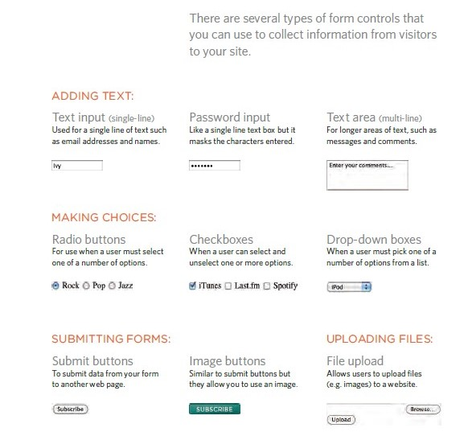

## Form
collect information from visitors to your site and there are several types of form controls .

+ ADDING TEXT:

+ Making Choiceces:

+ Submitting Forms:

## Tables notes

+ There are diffrent type of stayling like list-style-image, list-style-type and list-style-position.
+ Table cells can have different borders and spacing in different browsers, but there are properties you can use to control them and make them more consistent